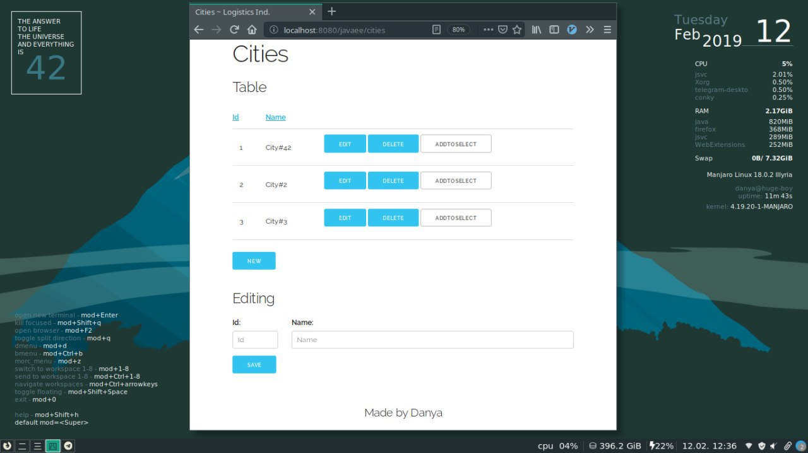
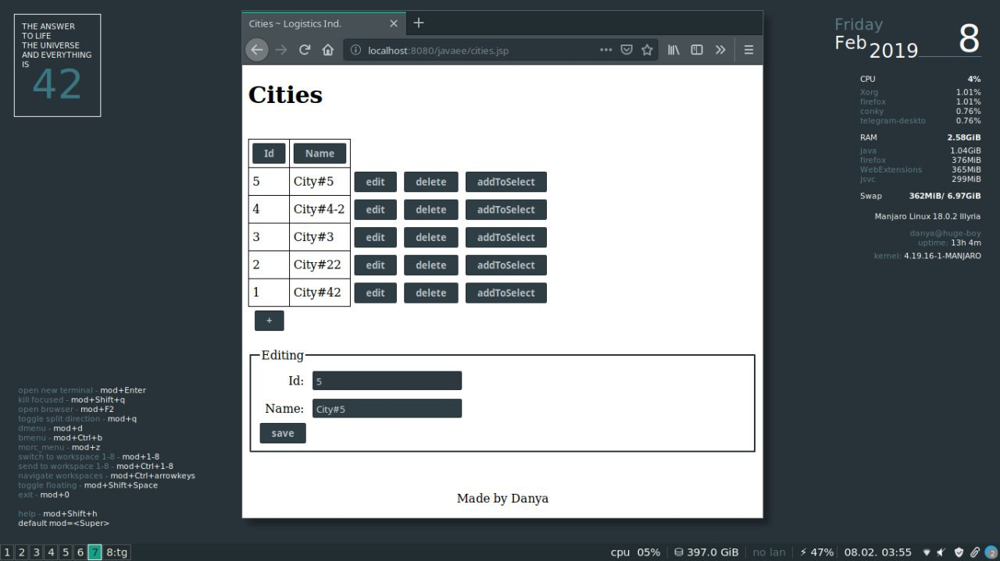

# javaee-proj

Here's the project i made when I was learning Java EE.
The standard stack was used here: Java EE, Servlets and JDBC with MySQL(MariaDB).

Screenshot after I added CSS (Not very impressive but still):

And that's how it looked before CSS:

# Running

To make it running you must have installed MySQL and Tomcat (and change in pom.xml directory where it must upload war-file🤷). 
After that build and deploy with maven.
